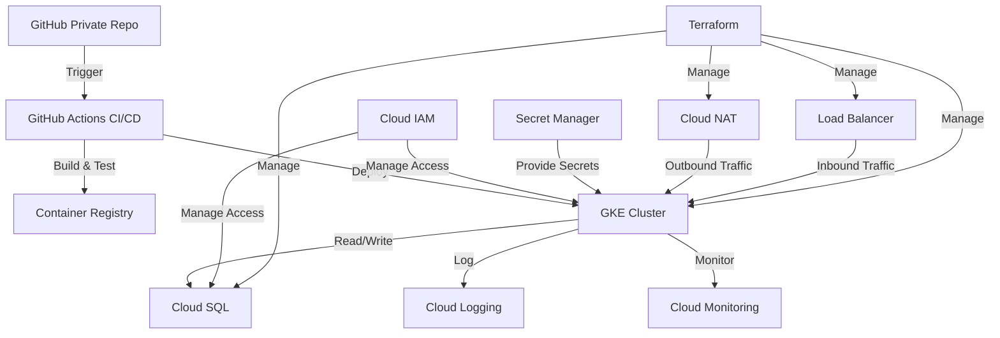

# Production Workflow and Best Practices

## Architecture Overview

## Workflow Explanation

Our production workflow follows a GitOps approach, leveraging Infrastructure as Code (IaC) and Continuous Integration/Continuous Deployment (CI/CD) principles. Here's a step-by-step breakdown of the workflow:

1. **Code Changes**:
   - Developers make changes to the application code or infrastructure definitions in the private GitHub repository.
   - Changes are proposed via pull requests for review.

2. **CI/CD Pipeline Trigger**:
   - GitHub Actions CI/CD pipeline is triggered on pull requests and pushes to the main branch.

3. **Infrastructure Provisioning**:
   - Terraform job in the CI/CD pipeline manages infrastructure:
     - Initializes Terraform
     - Plans infrastructure changes
     - Applies changes (only on merge to main)

4. **Build and Test**:
   - Application code is built and unit tests are run.
   - Container images are built and pushed to Container Registry.

5. **Deployment**:
   - Updated container images are deployed to the GKE cluster.
   - Kubernetes manifests are applied to update deployments.

6. **Monitoring and Logging**:
   - Deployed applications send logs to Cloud Logging.
   - Cloud Monitoring tracks system and application metrics.

## Best Practices Implemented

### 1. Version Control and Code Review
- All code (application and infrastructure) is version-controlled in GitHub.
- Pull request reviews ensure code quality and security.

### 2. Infrastructure as Code (IaC)
- Terraform is used to define and manage GCP resources.
- Infrastructure changes go through the same review process as application code.

### 3. CI/CD Automation
- GitHub Actions automates testing, building, and deployment processes.
- Reduces manual errors and ensures consistent deployments.

### 4. Containerization
- Applications are containerized for consistency across environments.
- Container images are versioned and stored in Container Registry.

### 5. Orchestration
- Google Kubernetes Engine (GKE) is used for container orchestration.
- Ensures high availability and scalability of applications.

### 6. Secret Management
- Sensitive information is stored in Secret Manager.
- Secrets are securely injected into applications at runtime.

### 7. Network Security
- Cloud NAT is used for secure outbound traffic from private GKE nodes.
- Load Balancer manages inbound traffic, improving security and performance.

### 8. Database Management
- Cloud SQL provides a managed database solution.
- Regular backups and update management are handled by GCP.

### 9. Monitoring and Logging
- Comprehensive monitoring with Cloud Monitoring.
- Centralized logging with Cloud Logging for easier troubleshooting and auditing.

### 10. Access Control
- Cloud IAM manages access to GCP resources.
- Principle of least privilege is enforced.

### 11. Scalability
- GKE and Cloud SQL provide built-in scalability options.
- Infrastructure can be easily scaled using Terraform.

### 12. Disaster Recovery
- Multi-region deployments can be implemented for critical services.
- Regular backups and documented recovery procedures ensure business continuity.

## Conclusion

This workflow embraces DevOps principles, ensuring a secure, scalable, and maintainable production environment. By leveraging GCP services and following these best practices, we create a robust system that can reliably deliver and scale our applications.
